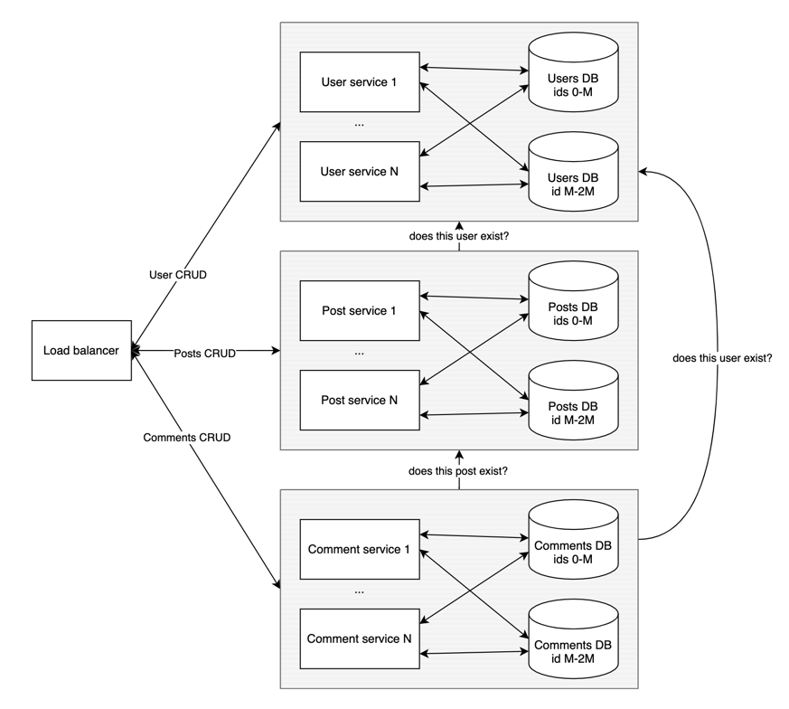

# Разделение проекта на микросервисы

## Функциональное расширение
В текущем виде проект разбивается на три сервиса:
1. Сервис пользователей – хранит информацию о пользователях
2. Сервис постов – отвечает за создание/чтение постов и выдачу ленты
3. Сервис комментариев – отвечает за создание/просмотр комментариев к постам

В дальнейшем потребуется отдельный сервис аутентификации, 
через который проходят все запросы от пользователей. 
Он будет проверять, что запросы действительно исходят от пользователя с некоторым идентификатором,
а остальные сервисы будут работать уже с этим идентификатором пользователя, принимая на веру, что это он.

## Клонирующее расширение
Чтобы справляться с нагрузкой, каждый из сервисов допускает расширение клонированием. 
Для уменьшения головной боли мы не храним в сервисе состояние – ему место либо в in-memory кэше типа Redis/Memcached, 
либо в базе данных. 

## Расширение по данным
За группой сервисов каждого типа предполагается поставить базу, в которой они будут хранить состояние.
Однако с увеличением числа пользователей может потребоваться шардить базу. 
Пользователей, посты и комментарии можно шардить по id, при этом особо популярных пользователей, 
на посты которых приходится большая нагрузка по чтению, можно вообще менеджить вручную в самый удобный/ненагруженный шард 
(эту идею я прочитал в книжке с кабанчиком).

## Картинка с сервисами
